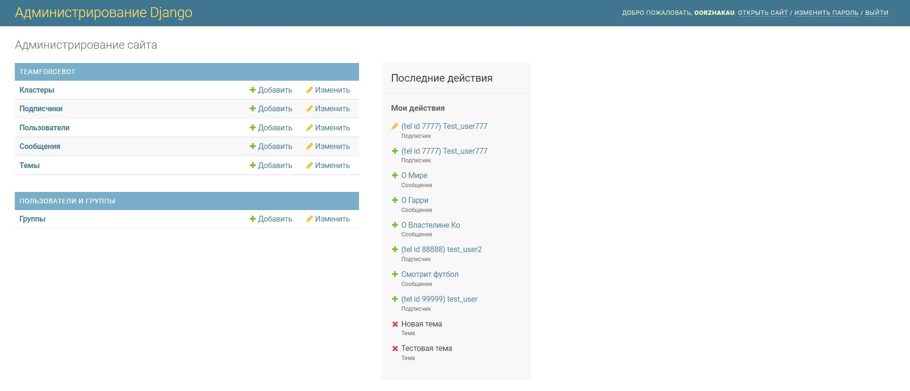
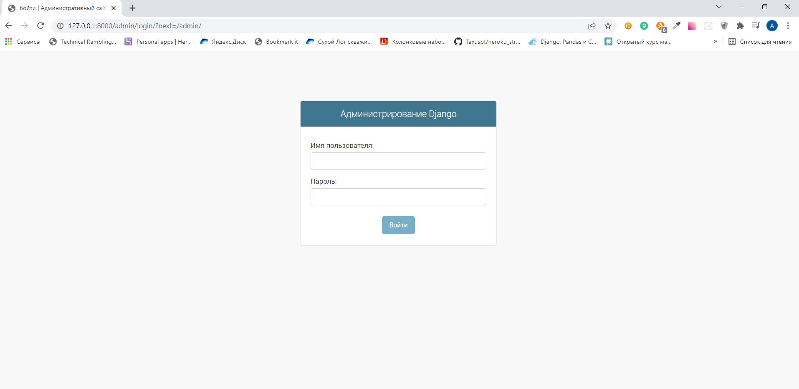
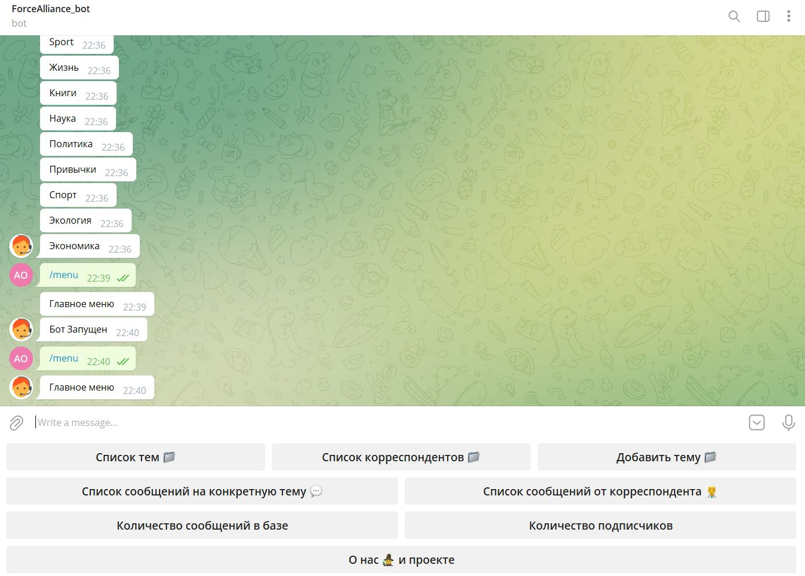
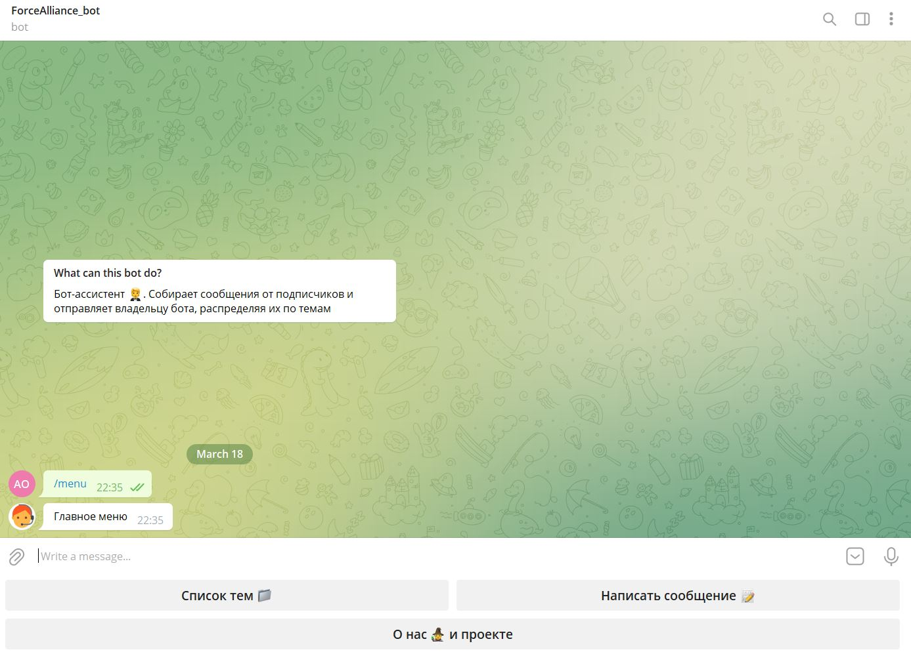
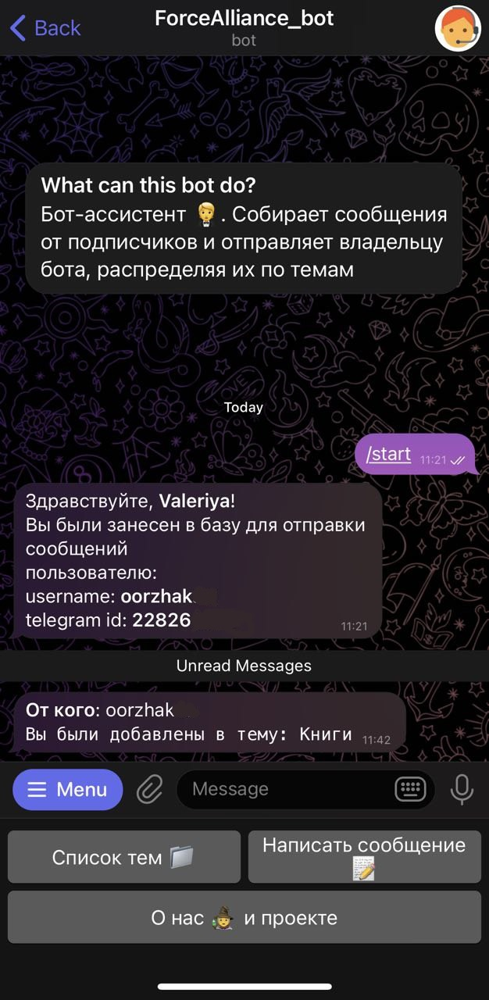
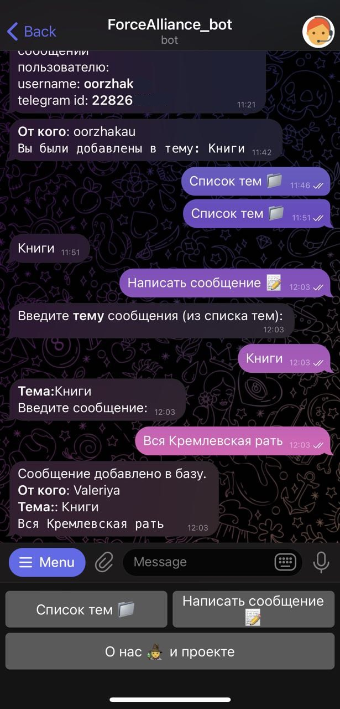
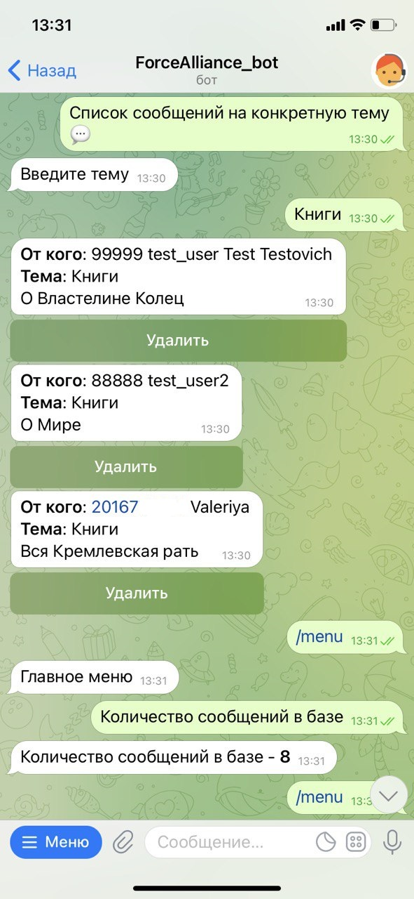
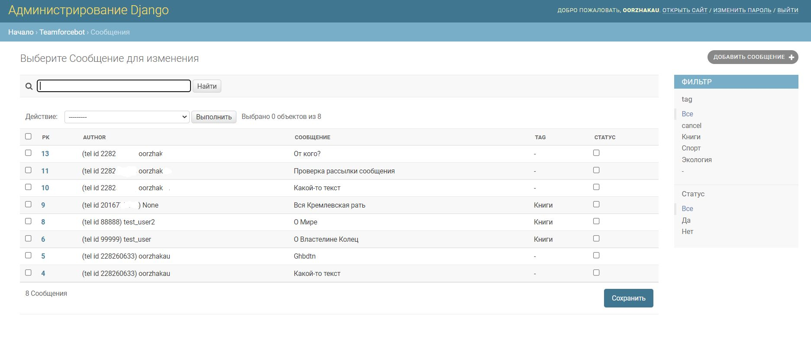

# TeamForce_bot
## Описание
Бот для хакатона TeamForce (Кейс № 3)

Telegram-bot получает сообщения по конкретной теме/проекту от внешних (в том числе новых) корреспондентов, накапливать их и буферизировать в БД.

В отличие от групп, потоки сообщений от каждого корреспондента изолированы между собой, но видны одним потоком пользователю, инициирующему запуск робота (то есть истинному получателю сообщений).

Бот реализован на базе PostgreSQL и Django ORM, с возможностью взаимодействовать с базой через админ-панель Django.


Логика телеграм-бота реализована с помощью ассинхронного фреймворка aiogram.

## Технологии
* Python 3.8
* Django 4.0
* PostgreSQL 4.0
* Aiogram 2.19
* Docker 3.1

## Запуск проекта в dev-режиме
- Устанавливаете docker и docker-compose;
```
sudo apt update
sudo apt install docker docker-compose -y
```
- Переименовываете файл .env_example на .env и заполняете его нужными значениями переменных окружения.<br>
Help по токенам
    <ul>
       <li><a href="https://core.telegram.org/bots#6-botfather">Токен телеграмм-бота</a></li>
       <li>Ваш telegram id можно узнать у бота @userinfobot</li>
    </ul>
- В папке проекта запускаете docker-compose:

```
docker-compose up -f docker-compose.yml up --build
```
- По адресу localhost:8003/admin/ переходим в панель и входим под ранее созданным superuser-ом;


- Проект запущен и готов к работе.

## Логика работы в telegram боте
* У пользователя-инициатора бота после команды /menu отображается административная панель, представленная ниже:



* У пользователя-подписчика на бота после команды /menu отображается меню ниже:



* Пользователь-инициатор создает темы, через команду "Добавить тему", далее добавляет в данную тему подписчиков (уже подписавшихся на бота) через команду "Добавить корреспондента(-ов) в тему". При этом подписчикам приходит уведомление, что они добавлены в в тему, которая отображается у них в "списке тем".
  


* После регистрации подписчика в теме, он может отправлять сообщения пользователю-инициатору через команду "Написать сообщение 📝"



* База данных буферизует все сообщения, и когда пользователь-инициатор захочет получить все сообщения по определенной теме, он может выполнить команду "Список cообщений на конкретную тему 💬"
  


* Сообщения между подписчиками изолированы между собой.

* Работу с базой данных можно вести через admin-панель Django:




### Список исполнителей
* [Александр Ооржак](https://github.com/Oorzhakau) (telegram @oorzhakau)
